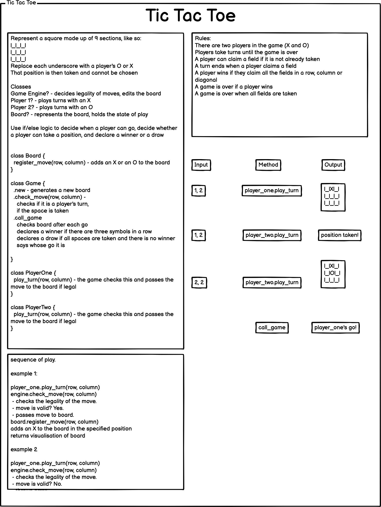

How to test properly for the reset() function? Easy to test that it resets gameOver... less easy for dependencies like turnChecker and board... Declare them as mocks and see if the logic as it stands resets them via the constructor in the same way it resets the real ones (i.e accesses the dependencies and alters them). I imagine it will work for turnChecker as it's directly accessing a value that is declared as mock, namely the turnCounter... but resetting the board involves calling a method within the board class... how do you access that via the mock, unless you create the method in the mock...

//refactoring to try and get all instance variables in the game class, with none in the dependencies 

//////////////////////////////////////////////////////////////////////////////////////////////////////////////

How to play:

1. Clone this repo
2. Run npm install to install dependencies
3. Open node and paste in the following:

const Game = require('./game')
const Player = require('./player');
const Board = require('./board');
const TurnChecker = require('./turnChecker')
const BoardUpdater = require('./boardUpdater')
const player = new Player;
const board = new Board;
const turnChecker = new TurnChecker
const boardUpdater = new BoardUpdater(board, player, turnChecker);
const game = new Game(board, player, boardUpdater, turnChecker);

4. To take a turn, enter the following (replacing x with the target row, and  y with the target column):
game.enterMove(x,y)

5. The game alternates between players automatically. The first time you enter a move, it will be for playerOne, the second time for playerTwo.

6. The game will log the board after each go, allowing you to plan yor next move.

7. The game will declare a winner/draw and reset the board to allow you to play another game. 

I hit a bit of a snag in resetting the board. The problem was that when I was returning callGame(), which as well as working out the winner also returned the a string announcing the winner, I couldn't then reset the board. I assume that this was because as soon as a return had been used in the function, that was the end of the function. I couldn't reset the board before returning callGame(), because this would mean that the instance variables callGame() used to determine the winner (board.newBoard and game.gameOver) would have been reset... This was what the problem code looked like:

``` enterMove(row, column) {
    this.player.enterMove(row, column)
    this.checkMove()
    if(this.movePermitted === false){
      return 'space taken'
      }
      else{
        this.boardUpdater.updateBoard()
        this.turnChecker.incrementTurnCounter()
        this.callGame()
        this.movePermitted = false
        console.log(this.board.newBoard.join('\r\n'))
      }
    if(this.gameOver === true)
      {return this.callGame()}
  	this.resetBoard()
  } ```

As a workaround, I had to assign the game result to an instance variable named 'result' using the callGame() function, and then return that as part of the enterMove() function having already reset the board. The problem is that this left the result instance variable set to whatever the result was, as it wasn't included in the reset() logic that reset the board, the turnCounter and the gameOver instance variable to their default states... I then reset the result instance variable as soon as a new move was entered. As follows:

```
enterMove(row, column) {
    this.result = ""
    this.player.enterMove(row, column)
    this.checkMove()
    if(this.movePermitted === false){
      return 'space taken'
      }
      else{
        this.boardUpdater.updateBoard()
        this.turnChecker.incrementTurnCounter()
        this.callGame()
        this.movePermitted = false
        console.log(this.board.newBoard.join('\r\n'))
      }
    if(this.gameOver === true){
      this.resetBoard()
      return this.result}
  }
	```

The question is whether this would be a problem in the long run. The next logical step would be to assign the game to an interface, whether via an engine that prompted a user for answers, or, preferably, a visual representation of a board, which would allow a player to click on their choice. If this were the case, given that the result is only used to return a message at the end of the game and players wouldn't have access to the inner workings of the game, presumably it wouldn't be a problem that at the beginning of the game, until a player took their first move, there would be an erroneously declared winner left over from the previous game... It is, however, frustrating, and I would be interested to know why it was not possible to simply run the reset function after calling a return value. Am I right in assuming that returning a value aborted the function, even though the return was enclosed within an if statement?


//////////////////////////////////////////////////////////////////////////////////////////////////////////////

Next steps:
Build an engine for obtaining user input via the CLI

OR

build a graphical representation of the board, and allow the user to click on their choice. This would obviously be preferable. Each square would be linked to a row, column combination as entered until now via node. 

Initially, given the existing logic, the game would have to be played from one machine, with players taking turns on the same keyboard. However, sharing a keyboard is not very convenient, so it would be a case of finding a way to have players play each other via different machines. This would probably involve logging in two players and assigning each of them a player number, either 1 or 2, that lasts for that session, or pushing their id into an array and determining whose turn it is based on their index in the array. Player 1/the player with index 0 in said array would only be allowed to take a turn when the turnCounter() was even, player 2/the player with index 1 when the turnCounter() was odd. The controller logic would prevent them from clicking when it was not their go, and display a message to tell them to wait. Perhaps when a player started a game they could send a message challenging another signed-up player to a game, and there could be prompts to take one's turn etc (though this is more suited to longer-lasting games than noughts and crosses...)

///////////////////////////////////////////////////////////////////////////////////////////

Plan:

Represent a square made up of 9 sections, like so:

|_|_|_|
|_|_|_|
|_|_|_|

Replace each underscore with a player's X or O
That position is then taken and cannot be chosen

CLASSES 

Game Engine? - decides legality of moves, edits the board
Player 1? - plays turns with an X
Player 2? - plays turns with an O
Board? - represents the board, holds the state of play

Use if/else logic to decide when a player can go, decide whether a player can take a position, and declare a winner or a draw


class Board {
		register_move(row, column) - adds an X or an O to the board
}

class Game {
		.new - generates a new board 
		.check_move(row, column) - 
				checks if it is a player's turn, 
				if the space is taken
		.call_game
				checks board after each go
				declares a winner if there are three symbols in a row
				declares a draw if all spaces are taken and there is no winner
				says whose go it is 
		
}

class PlayerOne {
		play_turn(row, column) - the game checks this and passes the move to the board if legal
}

class PlayerTwo {
		play_turn(row, column) - the game checks this and passes the move to the board if legal
}

///////////////////////////////////////////////////////////////////////////////////////////

SEQUENCE OF PLAY

example 1:

player_one..play_turn(row, column)
engine.check_move(row, column) 
	- checks the legality of the move. 
	- move is valid? Yes.
	- passes move to board.
board.register_move(row, column)
adds an X to the board in the specified position
returns visualisation of board

example 2

player_one..play_turn(row, column)
engine.check_move(row, column) 
	- checks the legality of the move. 
	- move is valid? No.
	- throws error

example 3 
player_two..play_turn(row, column)
engine.check_move(row, column) 
	- checks the legality of the move. 
	- move is valid? Yes
board.register_move(row, column)
adds an O to the board in the position
returns visualisation of board




Refactoring...

Combine playerOne and playerTwo into a player class, and just have them input their symbol 

OR

track the turns and assign odd goes to playerOne and even goes to playerTwo

still have a couple of failing tests, due to issues mocking the turnChecker and also issues mocking two methods from within the same mocked class... see the three skipped tests in game.test

could the game benefit from an engine that asked for user input. Would this just be a case of renaming the game class?

////////
